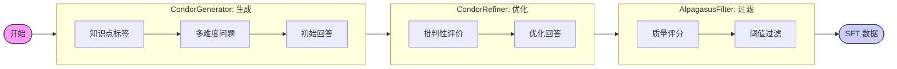
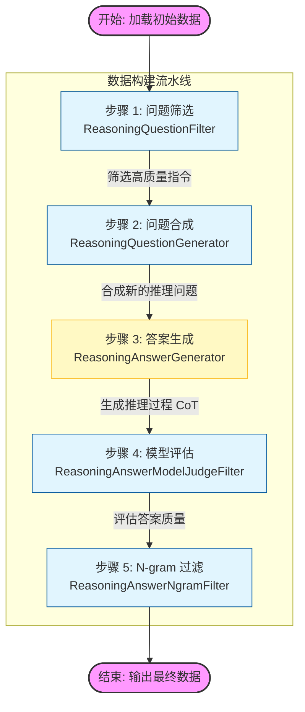
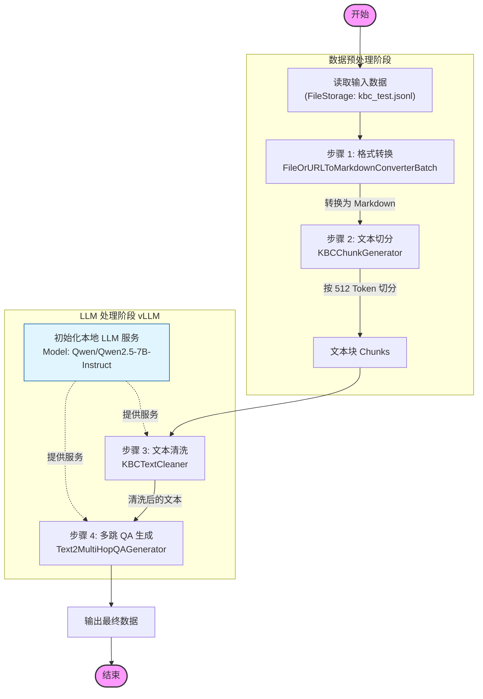
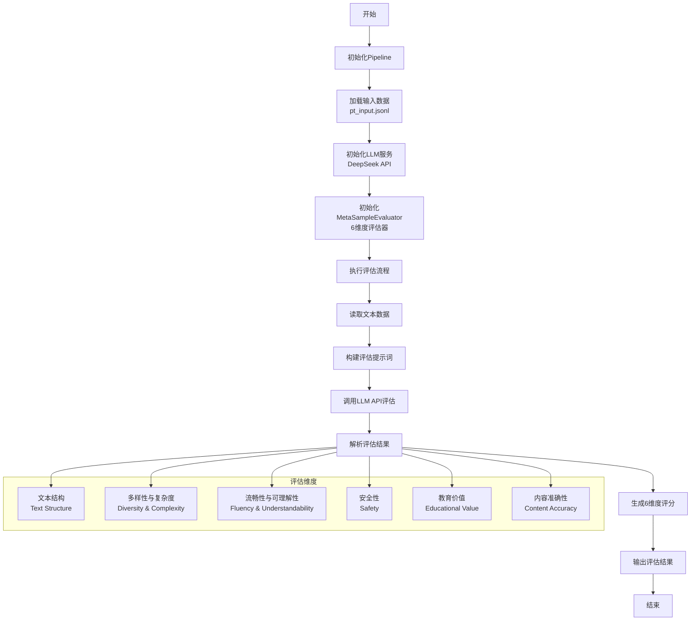

## text_sft_synthesis_from_scratch
ref: https://opendcai.github.io/DataFlow-Doc/zh/guide/sft_synthesis/#%E7%AC%AC%E4%BA%8C%E6%AD%A5-%E5%88%9B%E5%BB%BA%E6%96%B0%E7%9A%84dataflow%E5%B7%A5%E4%BD%9C%E6%96%87%E4%BB%B6%E5%A4%B9

#### **prompt** 根据已有的QA,提建议.
```
base_critique_prompt = f"""
There is now a user’s question and a model’s response. You need to write a critique for this response, pointing out the
strengths and weaknesses of the model’s answer to help the model improve its response.
Your critique must strictly adhere to the following format:
[Critique Start]
[Strength Start]Strength[Strength End]
[Weakness Start]Weakness[Weakness End]
[Suggestion Start]Suggestion[Suggestion End]
[Critique End]
Here is the user’s question and the model’s response: {dialogue}
Now it’s your turn. Please provide your Critique as required:
"""
```
#### **prompt** 基于提的建议,修正原有的answer
```
base_refine_prompt = """
Now there is a user's question, a model's answer, and the user's feedback. Please help modify the model's answer based on the user's feedback to make it better.
Your improved answer must strictly adhere to the following format:
[Improved Answer Start]Your answer[Improved Answer End]
Below is the user's question, the model's answer, and the feedback:
[Question Start]{question}[Question End]
[Answer Start]{answer}[Answer End]
[Feedback Start]{critique}[Feedback End]
Now it's your turn, please provide your improved answer as required:
"""
```
#### prompt: 基于给定的domain/ application theme/Task Scenario 生成多个不同难度的问题:
```
prompt = f"""
Now we need to create high-quality SFT data for LLM training, so we need you to produce a batch of such data. You only
need to create Questions. I will give you a theme for SFT data Questions. You need to create three
Questions of different difficulty levels based on this new theme.\\
Your Questions must meet the following requirements:\\
1. You must strictly create only three Questions at a time. These three Questions must be in the domain of {domain}
and the Questions should align with the given theme of {theme}.\\
2. The Questions you create must have context and sufficient information; they should not be abrupt and directly ask the
question.\\
3. Your reply must strictly follow the format below. Your Questions need to be included between [Question Start] and
[Question End], and the difficulty level should be indicated at the beginning, as in the following format:\\

[Easy][Question Start]Question[Question End]

[Medium][Question Start]Question[Question End]

[Hard][Question Start]Question[Question End]

4. Your Questions of different difficulty levels should be distinct and actually reflect the different levels of difficulty.\\
\quad \\

Now it's your turn. Please provide the three Questions of different difficulty levels you created about the theme of {theme} for {domain}, according to the requirements.
"""
```

#### prompt 基于大模型的质量评估
```python
# 设置评价维度，默认为 'quality'（质量） 
self.dimension = dimension 
# 系统提示词模板：设定上下文，告诉 AI 评审员需要针对指令、输入和回答给出反馈 
self.system_prompt_template = """ 我们希望针对 AI 助手在处理以下指令和输入时的表现，征求您的反馈。 指令：{instruction} 输入：{input} 回答：{response} """ 
# 用户提示词模板：规定评分标准和输出格式 
self.user_prompt_template = """ 请根据回答针对指令和输入的 {dimension}（维度）进行评分。 每位助手将获得 0 到 5 分之间的评分，分数越高表示其 {dimension} 水平越高。 请首先输出单行内容，仅包含代表分数的数值。 在接下来的第二行中，请提供您评估的详尽解释，并避免任何潜在偏见。 """
```




## text_sft_synthesis_from_seed
ref: https://opendcai.github.io/DataFlow-Doc/zh/guide/sft_synthesis/#%E7%AC%AC%E4%BA%8C%E6%AD%A5-%E5%88%9B%E5%BB%BA%E6%96%B0%E7%9A%84dataflow%E5%B7%A5%E4%BD%9C%E6%96%87%E4%BB%B6%E5%A4%B9


#### prompt: 基于给定的context, 生成QA
```python
base_prompt = """You are tasked with creating high-quality SFT data for LLM training.
    Please generate one question based on the provided context, focusing on diversity, relevance, and clarity.

    Requirements:
    1. Generate exactly one distinct and well-formed question.
    2. The question must be based on the context and include enough background for clarity.
    3. Output must follow this JSON format:
    {{
        "instruction": "QUESTION",
        "output": "ANSWER"
    }}

    Examples:
    {{
        "instruction": "Can you provide a list of healthy habits to maintain a healthy lifestyle? Please format your response as an HTML page with bullet points.",
        "output": "Here's an HTML page with bullet points for healthy habits: <html><body><h3>Healthy Habits:</h3><ul><li>Eating a balanced diet...</li></ul></body></html>"
    }},
    {{
        "instruction": "How can we use Python to calculate the GCD (greatest common divisor) of five numbers and express each number in terms of the GCD?",
        "output": "Here's a Python function that calculates the GCD of five numbers: def find_gcd(...) ..."
    }}

    {custom_section}

    Now, based on the following context, please generate one question:
    """
```
## text_conversation_synthesis_pipeline.py


#### prompt: 直接生成多轮QA 

```python
prompt = """
        Task Description and Rules 
        1. Generate multiple rounds of realistic user questions based on the provided topic: 
        - Based on a single core topic (provided directly by the user), generate multiple rounds of realistic user questions, comprising 6-8 turns in total. 
        - The questions should match the characteristics of real users in natural communication: sometimes simple, sometimes vague, or including contextual backgrounds, and should reflect the language style of daily communication. 
        - Note: Avoid directly including the exact expression of the input topic in the questions. Instead, abstract it with natural and conversational language in practical scenarios. 
        
        2. Dynamic Dialogue Information Flow in Conversations: Below are the relevant steps of the information flow: {info_flow}

        The dialogue style should adhere to the following requirements: 
        - Utilize natural phrasing and vivid language, avoiding overly mechanical responses. 
        - Favor shorter sentences in questions, with occasional subject omission allowed. 
        - Ensure smooth and logical transitions through lighthearted or entertaining interjections. 
        - Permit the expression of specific personality traits and individualized tones. 
        - Proactively introduce new topics when appropriate, ensuring relevance to the current theme. 
        
        The dialogue should comply with the following generation rules: 
        - For each round of dialogue, only simulate user questions without providing answers. 
        - Ensure the conversation flows naturally and reflects realistic interactive thinking. 
        - Avoid overly polished or templated content, ensuring the questions feel authentic and relatable in life scenarios. 
        
        Output Format: 
        Multi-turn Questions in JSON Format: 
        "category": "<Core Topic of the Conversation>", 
        "turns": ["<turn_1>", "<turn_2>", "<turn_3>", "..."] 
        To generate multi-turn queries with high topic consistency, please think step-by-step. 
        The input core topic for this task is: {topic}
        """

```

```python
        prompt = f"""
        Your task is to simulate a multi-turn conversation where you progressively answer a series of user questions provided under a given topic category. For each answer, focus on delivering a natural, contextually relevant, and actionable response while considering both the current question and future questions in the sequence. The goal is to ensure consistency and logical progression throughout the dialogue and to avoid unnecessary follow-up questions in the responses simultaneously. To generate multi-turn responses with high topic consistency, think step-by-step. Key Dialogue Style Requirements are as follows: 
        Content and Structure:
        1. Directly Answer the Current Question:
        - Provide a complete, useful response to the current question without posing additional questions unless they are directly relevant to future queries. 
        - If clarification or additional steps are needed, frame these as suggestions or explanations rather than questions.
        2. Be Context-Aware:
        - Always tailor each response to the current question while remaining mindful of the context provided by prior and future questions.
        - Avoid prematurely addressing future queries but create subtle links where necessary to ensure smooth progression.
        3. Clear, Action-Oriented Responses:
        - Focus on providing actionable advice, logical explanations, or troubleshooting steps rather than speculative or rhetorical remarks.
        - Avoid long or overly complex explanations; aim for clarity and efficiency.
        Tone and Style:
        1. Conversational and Supportive:
        - Use a natural, empathetic tone that simulates real-life problem-solving interactions.
        - Avoid mechanical or overly formal responses.
        2. Economical with Words:
        - Keep responses concise but informative. Minimize extraneous content while ensuring answers have enough detail to be helpful.
        3. No Unnecessary Questions:
        - Limit unnecessary questions in the responses and focus instead on providing actionable steps or solutions directly. Avoid follow-up questions that don’t align with the next user query.
        Turn-by-Turn Instructions:
        1. Answer Exclusively for the Current Question:
        - For each turn, generate an answer that directly addresses the immediate question. Avoid revisiting past details unnecessarily unless they are highly relevant.
        - While you shouldn’t anticipate or directly answer future queries, your response should create natural openings for upcoming questions if applicable.
        2. Avoid Irrelevant Follow-Up Questions:
        - If the immediate question doesn’t require clarification, frame your response as a statement or suggestion rather than a question.
        - Maintain alignment with the logical flow of dialogue to ensure each turn is coherent.
        3. Proactively Provide Scenarios or Steps:
        - Where appropriate, guide the user with specific recommendations, troubleshooting actions, or observations they can make without requiring back-and-forth clarification.
        Output Requirements:
        The output must simulate the conversation by only providing responses (one per turn) in a sequential manner. The final format must strictly adhere to valid JSON and include the required structure.
        
        The input core topic and questions-only turns for this task is: 
        core topic: {topic}
        queries:
        {', '.join([f'User query: {query}' for query in queries])}
        """
```


##  reasoning_general_pipeline.py



####  流程详细说明：
1. 数据加载 ：从 pipeline_general.json 加载初始数据。
2. 步骤 1 (问题筛选) ：使用模型对输入的指令（Instruction）进行质量评估和筛选，保留高质量的种子问题。
3. 步骤 2 (问题合成) ：基于筛选后的种子问题，使用模型合成新的、可能更复杂的推理问题。
4. 步骤 3 (答案生成) ：调用大模型（DeepSeek）为合成的问题生成详细的推理过程（Chain of Thought, CoT）。
5. 步骤 4 (模型评估) ：使用模型作为裁判（Judge），对生成的 CoT 答案进行质量打分和评估（可能会参考 Golden Answer）。
6. 步骤 5 (N-gram 过滤) ：使用 N-gram 算法对生成的文本进行统计特征过滤（如去重、过滤重复片段等），确保数据多样性。
7. 输出 ：最终得到经过清洗、生成和验证的高质量推理数据集。

#### prompt: 问题质量评估 ; aim: 找到那些真的需要推理的任务

```python 
prompt = f"""你现在负责一项推理任务的审核工作。请按顺序执行以下四个步骤，并在遇到第一个错误时停止：

0. **初步验证**：验证输入是否仅包含一个清晰的推理任务（不得包含“改写”、“翻译”或“提供答案”等额外指令）；如果不符合，输出 judgement_test=false。
1. **格式检查**：检查拼写、语法和格式（例如代码缩进、LaTeX 公式、Markdown 语法），此步骤无需解读语义。
2. **前提验证**：针对每一个最小前提（即不可再分解的推论基础），验证其是否违反常识、领域事实或任务要求（例如，“半个人”是无效的；除非有明确假设，否则不允许魔法操作）；如果前提无效，则判定失败。
3. **逻辑一致性检查**：检查前提之间或推理过程中是否存在矛盾，或者最终结果是否明显不合理、不可解；若是，则判定失败。
4. **完整性检查**：如果以上步骤均通过，检查是否有足够的信息来完成该任务；缺少必要条件则判定失败，冗余细节是可以接受的。

完成上述步骤后，请严格按以下格式输出：
{{
    "judgement_test": true/false,
    "error_type": "<错误描述或 null>"
}}
你可以包含你的思考过程，但最终输出必须是上述 JSON 格式。

以下是待评估的内容：
-------------------------------
{question}
-------------------------------
"""
```

## kbcleaning_pipeline



####  详细步骤说明
- 输入 (Input) :

- 从指定路径 ( ../example_data/KBCleaningPipeline/kbc_test.jsonl ) 读取初始数据条目。
- 步骤 1: 格式转换 (FileOrURLToMarkdownConverterBatch) :

- 功能 : 将输入的文件或 URL 内容批量转换为 Markdown 格式。
- 特点 : 使用 vlm-vllm-engine 作为后端处理引擎。
- 步骤 2: 文本切分 (KBCChunkGenerator) :

- 功能 : 将 Markdown 文本切分为较小的文本块。
- 配置 : 使用 Token 方式切分，每个块大小为 512 个 Token，使用 Qwen/Qwen2.5-7B-Instruct 的 tokenizer。
- LLM 服务初始化 (LocalModelLLMServing_vllm) :

- 功能 : 启动本地大模型服务，供后续步骤调用。
- 配置 : 加载 Qwen/Qwen2.5-7B-Instruct 模型，使用 vLLM 推理加速（配置了 4 卡张量并行）。
- 步骤 3: 文本清洗 (KBCTextCleaner) :

- 功能 : 调用 LLM 对切分后的文本块进行清洗，修正错误或去除无关内容。
- 步骤 4: 多跳 QA 生成 (Text2MultiHopQAGenerator) :

- 功能 : 调用 LLM 基于清洗后的文本生成多跳（Multi-hop）问答对。
- 配置 : 每个文本块生成 5 个问题。
- 输出 (Output) :

- 流程结束，生成包含清洗后文本及对应问答对的数据。

#### prompt: 生成多个事实相关的QA
```
"""\
                您是专业的多跳问答生成专家，必须严格遵循以下专业标准：

                █ 核心要求
                1. 必须识别上下文中的2-3个关联事实
                2. 设计需要跨事实推理的复杂问题
                3. 推理链必须满足：
                    - 至少包含2-3个逻辑步骤
                    - 每个步骤明确标注序号
                    - 步骤间存在因果或递进关系
                4. 最终答案必须整合所有推理结论
                5. 只关注正文内容，避免根据链接、参考文献等附加信息合成问答。
                
                █ 输出规范
                6. 仅允许输出以下结构的纯JSON：
                {
                    "question": "需要跨事实推理的问题",
                    "reasoning_steps": [
                        {"step": "第一推理步骤（必须引用事实1）"},
                        {"step": "第二推理步骤（必须关联事实2）"}
                    ],
                    "answer": "整合所有步骤的最终答案",
                    "supporting_facts": ["原文事实1", "原文事实2"],
                    "type": "领域标签"
                }
                7. 支撑事实必须：
                    - 从上下文逐字提取
                    - 与推理步骤严格对应
                    - 不得改写或概括

                █ 示例
                上下文：
                "量子纠缠现象由爱因斯坦提出质疑。后来贝尔实验证实了其真实性。该现象是量子计算的基础。"

                合格输出：
                {
                    "question": "为什么量子纠缠现象对量子计算很重要？",
                    "reasoning_steps": [
                        {"step": "贝尔实验证实了量子纠缠的真实性"},
                        {"step": "该现象是量子计算的基础"}
                    ],
                    "answer": "因为量子纠缠被证实真实且是量子计算的基础",
                    "supporting_facts": [
                        "后来贝尔实验证实了其真实性",
                        "该现象是量子计算的基础"
                    ],
                    "type": "量子物理"
                }

                █ 违规处理
                以下情况将拒绝输出：
                - 推理步骤少于2步
                - 存在未引用的支撑事实
                - JSON外出现任何附加文本
                """
```

## quick_evaluate.py



#### 评估维度

每个文本会从以下6个维度获得1-5分的评分：

1. 文本结构 (Text Structure) : 拼写、语法、词汇丰富度、句子结构
2. 多样性与复杂度 (Diversity & Complexity) : 内容丰富度和概念多样性
3. 流畅性与可理解性 (Fluency & Understandability) : 文本流畅度和易读性
4. 安全性 (Safety) : 是否包含不当内容、脏话或PII信息
5. 教育价值 (Educational Value) : 是否提供见解、启发思考或学习价值
6. 内容准确性 (Content Accuracy) : 真实性、相关性和实用性